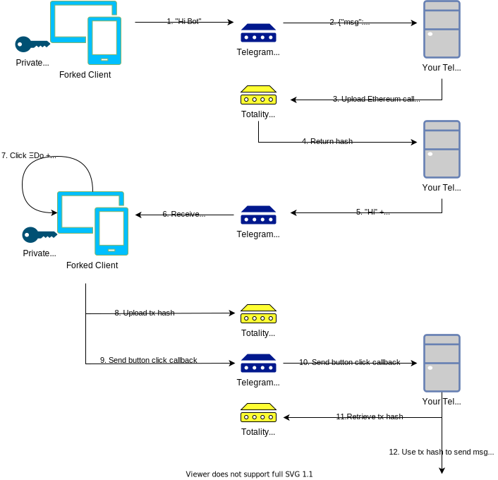

# Protocol

Telegram Totality adds an extra layer on top of the regular Telegram protocol. The regular Telegram protocol is of course running on official Telegram servers. The Totality protocol is currently a centralized webserver, in the future this should be decentralized.

Current endpoint: `http://monnie.totality.cc:7800/`

---

In the image below the flow describes a user that sends a message from his Totality client to a Totality enabled bot. The bot let's the user send an Ethereum transaction.

1. User sends a regular text message.
2. The Telegram server delivers to message to your bot.
3. You want the user to publish an Ethereum transaction, you [upload](/protocol/api/#post_1) your Ethereum call to the protocol.
4. The protocol returns an hash.
5. You send at least 2 buttons, with the following callback-data: `tgtotdo-<hash>` and `tgtotca-<hash>`, the first one is for a callback. where the user signs the transaction, the second one is to decline signing the transaction. Currently [python-telegram-bot](/implementations/#python-telegram-bot) is adding a 3rd button, which links people to [custodial-bot](/implementations/#custodial-bot)

6. User receives this message.
7. User clicks ΞDo, [retrieves](/protocol/api/#get_1) call, signs, and published the transaction.
8. The Totality client [creates](/protocol/api/#post_2) and [uploads](/protocol/api/#put) the transaction hash.
9. The Totality client sends the button click callback to the Telegram servers.
10. Your bot receives the callback.
11. Your bot [retrieves](/protocol/api/#get_2) the transaction hash.
12. Your bot decides action based on transaction hash.